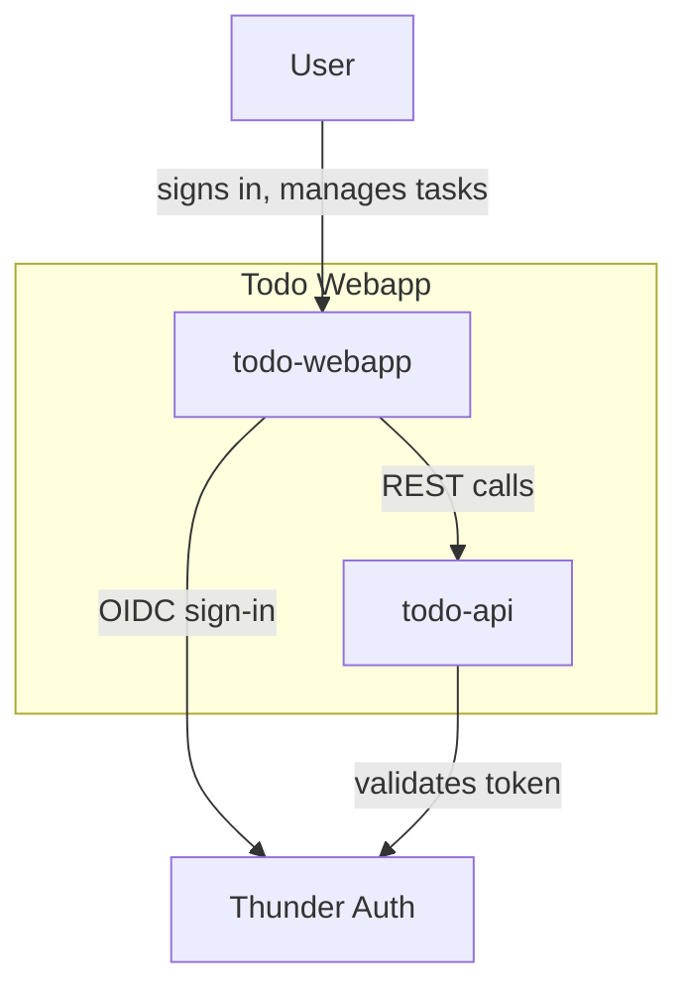
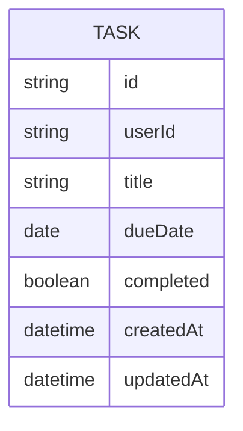
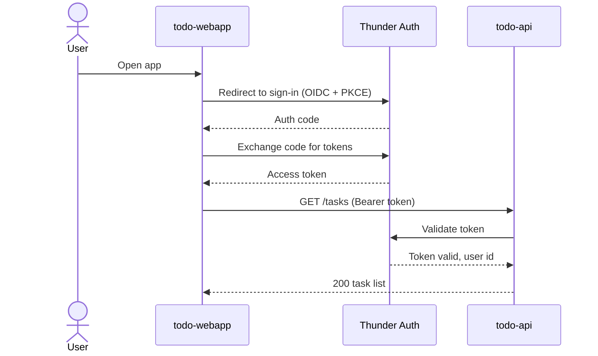
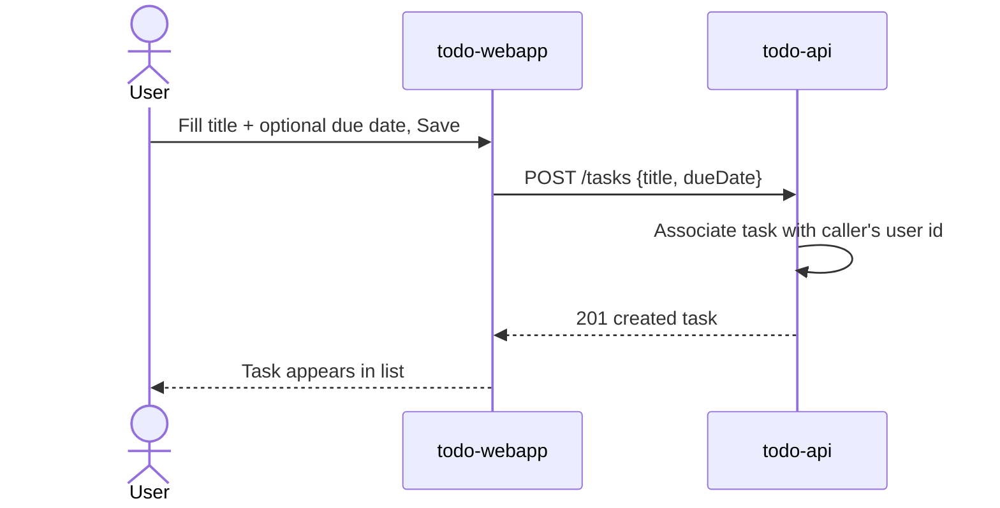
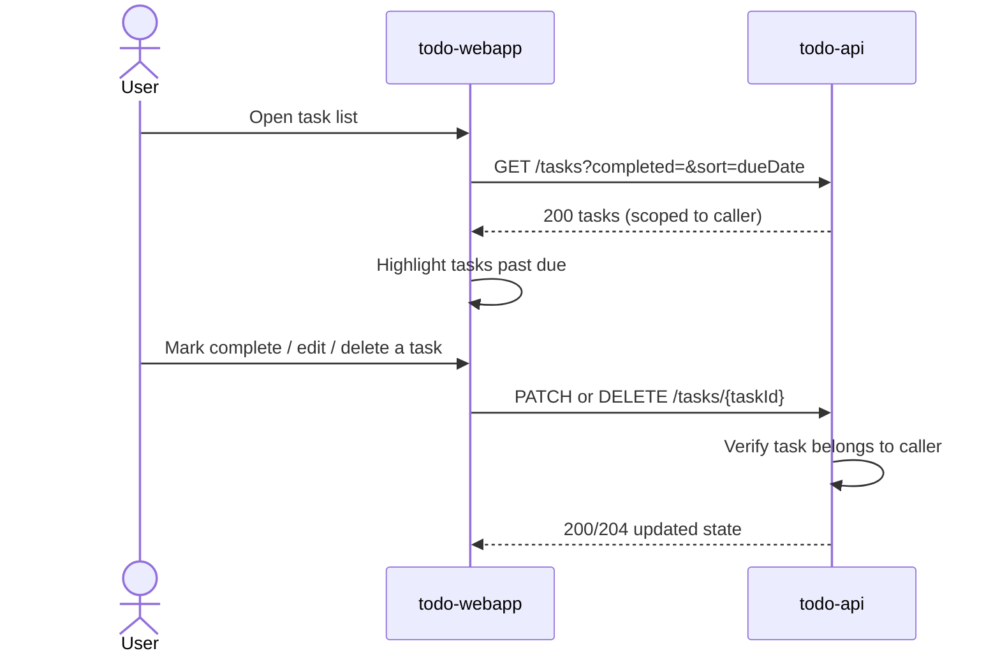

# Todo Webapp — Design

## Overview

A single-page React web app (`todo-webapp`) lets a signed-in user manage a private list of tasks, each with a title, an optional due date, and a completed flag. It talks to a Ballerina REST API (`todo-api`) that owns all task data in a dedicated Postgres database (`todo-db`) and scopes every read and write to the caller's own user id. Sign-in for both the app and the API is handled by Thunder, the platform IDP, via SSO.

## Context (C1)

## Domain model (ER)

`userId` is the signed-in user's id as resolved from their Thunder token; there is no local User table — Thunder is the source of identity. Every Task belongs to exactly one user, and a user's tasks are never visible to another user.

## Key flows

### Sign-in

### Create a task

### View, complete, edit, delete, sort/filter

